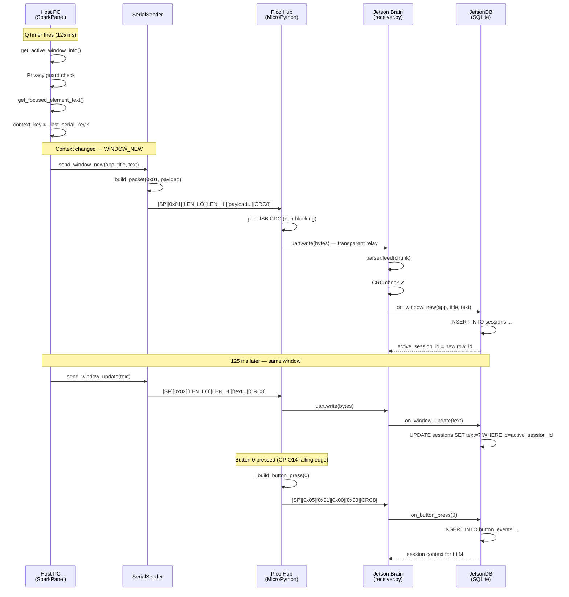

# SPARK — Engineering Specification
## Host-Side Context Engine & Firmware Integration Layer

**Version:** 1.0
**Status:** Draft
**Nodes:** Host PC (macOS/Win) · Pico Hub (RP2040/MicroPython) · Jetson Brain (NVIDIA)

---

## Table of Contents

1. [System Overview](#1-system-overview)
2. [Host-Side Engineering — Data Acquisition](#2-host-side-engineering--data-acquisition)
3. [Firmware Integration — Pico Hub & Jetson Interface](#3-firmware-integration--pico-hub--jetson-interface)
4. [Integration Protocol — Wire Format & Handshake](#4-integration-protocol--wire-format--handshake)
5. [Error Handling & Fault Tolerance](#5-error-handling--fault-tolerance)
6. [OpCode Reference Table](#6-opcode-reference-table)

---

## 1. System Overview

SPARK is a distributed assistive input system composed of three physically distinct compute nodes communicating over two serial channels.

```
┌──────────────────────┐   USB CDC      ┌──────────────────────┐   UART/USB     ┌──────────────────────┐
│     HOST PC          │ ────────────→  │    PICO HUB          │ ────────────→  │   JETSON BRAIN       │
│  macOS / Windows     │  115200 baud   │  RP2040 MicroPython  │  115200 baud   │  NVIDIA Jetson       │
│                      │                │                      │                │                      │
│  • AccessibilityMgr  │                │  • Serial passthrough│                │  • PacketParser      │
│  • WindowTracker     │                │  • Button GPIO IRQ   │                │  • JetsonDB          │
│  • SerialSender      │                │  • Packet injection  │                │  • LLM interface     │
│  • SparkPanel (Qt6)  │                │                      │                │                      │
└──────────────────────┘                └──────────────────────┘                └──────────────────────┘
         ↑
    USB Raw HID
         ↓
┌──────────────────────┐
│  PICO (QMK firmware) │
│  SparkHIDClient      │
│  Text → keystrokes   │
└──────────────────────┘
```

> **Note:** The Host connects to two separate Pico devices — one running QMK (HID text output path) and one running MicroPython (context relay path). These are independent USB connections.

---

## 2. Host-Side Engineering — Data Acquisition

### 2.1 Polling Architecture

The Host runs a deterministic 8 Hz acquisition loop driven by a `QTimer` with a 125 ms period. Each tick must complete within **40 ms** to maintain headroom before the next tick arrives.

```
125 ms tick budget
├─ OS Accessibility API call    ≤ 20 ms   (AXUIElement / UIA)
├─ Privacy guard evaluation     ≤  1 ms   (in-memory set/list lookup)
├─ Browser tab AppleScript      ≤ 10 ms   (only when active app is a browser)
├─ Context key comparison       ≤  1 ms
├─ Serial packet build + write  ≤  3 ms
└─ Qt UI update                 ≤  5 ms
                              ────────
                         Total ≤ 40 ms   (leaves 85 ms idle headroom)
```

If any single call exceeds 40 ms (e.g., AppleScript stall), the next tick is simply delayed — the `QTimer` is non-accumulating. No packets are dropped; the loop self-corrects on the next cycle.

### 2.2 AccessibilityManager

`AccessibilityManager` is a platform-agnostic façade over two OS-specific providers:

| Platform | Provider | API |
|---|---|---|
| macOS | `MacOSAccessibilityProvider` | `AXUIElement`, `NSWorkspace` via PyObjC |
| Windows | `WindowsAccessibilityProvider` | UI Automation (stub, future) |

The manager attempts text extraction in priority order:

```
1. get_focused_element_text()   → AXValue of focused AX element
2. get_window_text()            → AXValue of front window
```

The first non-empty result is used. `TextSource` enum (`FOCUSED_ELEMENT`, `FULL_WINDOW`) is recorded alongside the text for provenance tracking.

### 2.3 State Tracking — New Window vs. Existing Window

`WindowContextTracker` maintains a `context_key` for the active window. The key is computed as:

```
context_key = f"{app_name}|{url}"    # browser tab (Safari, Chrome)
context_key = f"{app_name}|{title}"  # all other applications
```

On each poll tick `_on_poll_tick()` compares the current `context_key` against `self._last_serial_key`:

```
┌─────────────────────────────────────────┐
│            Poll Tick (125 ms)           │
└────────────────────┬────────────────────┘
                     │
           ┌─────────▼──────────┐
           │  Get active window │
           │  (AccessibilityMgr)│
           └─────────┬──────────┘
                     │
           ┌─────────▼──────────┐
           │  Privacy Guard     │◄── blocked? → return (no packet sent)
           └─────────┬──────────┘
                     │
           ┌─────────▼──────────┐
           │  Extract text      │◄── no text? → return
           └─────────┬──────────┘
                     │
         ┌───────────▼───────────┐
         │  context_key changed? │
         └───┬───────────────────┘
             │                   │
            YES                  NO
             │                   │
    ┌────────▼──────┐   ┌────────▼──────┐
    │  send 0x01    │   │  send 0x02    │
    │  WINDOW_NEW   │   │  WINDOW_UPDATE│
    └───────────────┘   └───────────────┘
```

This ensures the Jetson database receives exactly **one INSERT per window visit** and **N UPDATE rows** during the visit — minimising storage and query complexity.

### 2.4 Binary Serialisation

`SerialSender` calls builders from `core/protocol.py`. All multi-byte integers are **little-endian**, matching the `struct` format character `<`.

#### WINDOW_NEW (0x01) payload layout

```
Offset  Size  struct fmt  C type     Field
──────  ────  ──────────  ─────────  ─────────────────────────
0       1     <B          uint8_t    app_name byte length (0–255)
1       N     Ns          char[]     app_name UTF-8 (no null)
1+N     1     <B          uint8_t    title byte length (0–255)
2+N     M     Ms          char[]     title UTF-8 (no null)
2+N+M   2     <H          uint16_t   text byte length (LE)
4+N+M   L     Ls          char[]     text UTF-8 (no null)
```

#### WINDOW_UPDATE (0x02) payload layout

```
Offset  Size  struct fmt  C type     Field
──────  ────  ──────────  ─────────  ─────────────────────────
0       2     <H          uint16_t   text byte length (LE)
2       L     Ls          char[]     text UTF-8 (no null)
```

#### BUTTON_PRESS (0x05) payload layout

```
Offset  Size  struct fmt  C type     Field
──────  ────  ──────────  ─────────  ─────────────────────────
0       1     <B          uint8_t    button_id (0–3)
```

---

## 3. Firmware Integration — Pico Hub & Jetson Interface

### 3.1 Hardware Routing

The Pico Hub performs **transparent serial bridging** between two physical channels:

```
Host PC                      Pico RP2040                   Jetson Brain
────────                     ──────────                    ────────────
USB CDC (tty.usbmodem*)  →  sys.stdin.buffer          →  UART0 RX (GP1)
                             UART0 TX (GP0)
```

| Signal | Pico Pin | Direction | Notes |
|---|---|---|---|
| USB D+/D- | USB connector | ↔ Host | CDC serial, 115200 baud |
| UART TX | GP0 | → Jetson | 115200 baud, 8N1 |
| UART RX | GP1 | ← Jetson | (reserved, future ACK) |
| Button 0 | GP14 | ← GND via switch | Active-low, pull-up enabled |
| Button 1 | GP15 | ← GND via switch | Active-low, pull-up enabled |
| Button 2 | GP16 | ← GND via switch | Active-low, pull-up enabled |
| Button 3 | GP17 | ← GND via switch | Active-low, pull-up enabled |

The relay loop runs at ~100 Hz (10 ms sleep), well above the 8 Hz incoming packet rate. USB bytes are forwarded in 64-byte chunks via `select.poll()` with a zero timeout (non-blocking).

### 3.2 Packet Interleaving — Button Injection

The Pico never decodes Host packets. It treats the Host byte stream as opaque and writes it verbatim to UART. Button packets are **injected between Host packets** at naturally occurring boundaries.

Since `select.poll(0)` is polled first each loop iteration, the Pico flushes all pending Host bytes before checking buttons. A `BUTTON_PRESS` packet is only written after the current USB chunk has been forwarded, eliminating mid-packet corruption:

```
Loop iteration (10 ms)
│
├─ 1. poll USB CDC (non-blocking)
│     if data available → uart.write(chunk)          ← Host bytes forwarded first
│
└─ 2. scan GPIO 14–17 for falling edge
      if button pressed → uart.write(BUTTON_PRESS)   ← injected after, never during
```

Because all SPARK packets are self-framed (MAGIC + CRC), even if an injection occurs between two back-to-back Host packets, the Jetson `PacketParser` will correctly parse all three packets in sequence.

### 3.3 Jetson SQL State Machine

`JetsonDB` maintains a single `active_session_id` integer. The state machine has three transitions:

```
                    ┌─────────────────────────────────────────┐
                    │          Jetson PacketParser             │
                    └───────────────┬─────────────────────────┘
                                    │ on_packet(dict)
                    ┌───────────────▼────────────────────────┐
                    │         handle_packet()                 │
                    └──┬──────────────┬──────────────┬───────┘
                       │              │               │
               type=0x01        type=0x02        type=0x05
                       │              │               │
           ┌───────────▼──┐  ┌────────▼──────┐  ┌────▼────────────────────┐
           │   INSERT      │  │    UPDATE     │  │  Query active session   │
           │   sessions    │  │   sessions    │  │  → pass to LLM context  │
           │               │  │   SET text=?  │  │                         │
           │  store new    │  │   WHERE id=   │  │  (future: trigger LLM   │
           │  row_id as    │  │   active_id   │  │   inference call)       │
           │  active_id    │  │               │  │                         │
           └───────────────┘  └───────────────┘  └─────────────────────────┘
```

#### SQL Schema

```sql
CREATE TABLE sessions (
    id          INTEGER PRIMARY KEY AUTOINCREMENT,
    app_name    TEXT    NOT NULL,
    title       TEXT    NOT NULL,
    text        TEXT    NOT NULL DEFAULT '',
    started_at  REAL    NOT NULL,  -- Unix timestamp
    updated_at  REAL    NOT NULL   -- Unix timestamp, updated on every 0x02
);

CREATE TABLE button_events (
    id          INTEGER PRIMARY KEY AUTOINCREMENT,
    button_id   INTEGER NOT NULL,          -- 0–3
    session_id  INTEGER,                   -- FK → sessions.id (nullable)
    timestamp   REAL    NOT NULL
);
```

#### Trigger 0x01 — INSERT

```sql
INSERT INTO sessions (app_name, title, text, started_at, updated_at)
VALUES (?, ?, ?, unixepoch('now'), unixepoch('now'));
-- active_session_id ← last_insert_rowid()
```

#### Trigger 0x02 — UPDATE

```sql
UPDATE sessions
SET    text = ?, updated_at = unixepoch('now')
WHERE  id = :active_session_id;
-- No new row created. One row per window visit regardless of 8 Hz update rate.
```

#### Trigger 0x05 — BUTTON PRESS context fetch

```sql
SELECT app_name, title, text, started_at
FROM   sessions
WHERE  id = :active_session_id;
-- Result passed to LLM inference pipeline
```

---

## 4. Integration Protocol — Wire Format & Handshake

### 4.1 Packet Frame

Every packet on the wire (both Host→Hub and Hub→Jetson channels) uses this identical frame:

```
 Byte 0    Byte 1    Byte 2    Byte 3    Byte 4    Byte 5..N    Byte N+1
┌─────────┬─────────┬─────────┬─────────┬─────────┬───────────┬─────────┐
│  0x53   │  0x50   │  TYPE   │ LEN_LO  │ LEN_HI  │  PAYLOAD  │  CRC8   │
│  'S'    │  'P'    │ 1 byte  │         │  (LE)   │ LEN bytes │ 1 byte  │
└─────────┴─────────┴─────────┴─────────┴─────────┴───────────┴─────────┘
│◄─────── MAGIC ──────────────►│◄────── HEADER ───────────────►│         │
│◄─────────────────────── CRC covers everything above ─────────►│         │
```

> **Note on START/END bytes:** This protocol uses a two-byte `MAGIC` sequence (`SP` = `0x53 0x50`) as a synchronisation marker rather than separate START and END bytes. The `PacketParser` state machine re-synchronises on MAGIC after any framing error, achieving the same fault isolation without adding 2 bytes of overhead per packet.

| Field | Size | Type | Description |
|---|---|---|---|
| MAGIC | 2 bytes | `uint8_t[2]` | `{0x53, 0x50}` — sync sequence `'SP'` |
| TYPE | 1 byte | `uint8_t` | OpCode — see §6 |
| LEN | 2 bytes | `uint16_t` LE | Payload byte count |
| PAYLOAD | LEN bytes | `uint8_t[]` | OpCode-specific data |
| CRC8 | 1 byte | `uint8_t` | CRC-8/MAXIM over all preceding bytes |

Minimum packet size: **6 bytes** (0-byte payload).
Maximum payload: **65535 bytes** (governed by `uint16_t` LEN field).

### 4.2 CRC Algorithm

**CRC-8/MAXIM** (Dallas 1-Wire): poly = `0x31`, reflected input and output, init = `0x00`, XorOut = `0x00`.

```c
uint8_t crc8(const uint8_t *data, size_t len) {
    uint8_t crc = 0;
    for (size_t i = 0; i < len; i++) {
        crc ^= data[i];
        for (int b = 0; b < 8; b++)
            crc = (crc & 1) ? (crc >> 1) ^ 0x8C : (crc >> 1);
    }
    return crc;
}
```

### 4.3 Sequence Diagram — Window Change Event



### 4.4 Sequence Diagram — Pico Button Injection Detail

```mermaid
sequenceDiagram
    participant USB as USB CDC<br/>(Host bytes)
    participant Loop as Pico Main Loop<br/>(10 ms)
    participant GPIO as GPIO 14–17
    participant UART as UART TX → Jetson

    loop Every 10 ms
        Loop->>USB: select.poll(timeout=0)
        alt bytes available
            USB-->>Loop: chunk (≤64 bytes)
            Loop->>UART: uart.write(chunk)
        end

        Loop->>GPIO: read pins 14–17
        alt falling edge detected on pin N
            Loop->>Loop: _build_button_press(N)
            Loop->>UART: uart.write(BUTTON_PRESS packet)
            Note over UART: Injected AFTER host chunk,<br/>never mid-packet
        end
    end
```

---

## 5. Error Handling & Fault Tolerance

### 5.1 Host USB Disconnect (Pico unplugged)

`SerialSender._send()` catches `serial.SerialException` on write and sets `self._serial = None`. The host continues operating normally — window tracking, UI updates, and HID device communication are unaffected. The next poll tick calls `_send()`, which returns `False` silently. No reconnect timer is implemented in v1.0; reconnect requires `SerialSender.connect()` to be called again (e.g., on application restart or a future reconnect button).

### 5.2 Pico → Jetson UART Disconnect

The Pico has no write-error detection in v1.0 — `uart.write()` is fire-and-forget. Bytes written to the UART hardware buffer while the Jetson is not listening will be silently dropped by the RP2040 hardware. No session state is corrupted; when the Jetson receiver restarts it simply waits for the next `MAGIC` sequence to re-synchronise.

### 5.3 CRC Failure on Jetson

`PacketParser._dispatch()` discards any packet whose computed CRC does not match the received CRC byte and calls `_reset()`. The parser re-enters `_SYNC` state and waits for the next `MAGIC` sequence. Because packets are individually framed, a single corrupted packet does not affect subsequent packets.

### 5.4 Jetson UART Buffer Full

The Jetson `serial.read(256)` call has a 1-second timeout. If the read loop stalls (e.g., heavy LLM inference blocking the thread), the OS UART FIFO will eventually overflow and drop bytes. The `PacketParser` will detect the resulting framing error via CRC mismatch and re-synchronise on the next `MAGIC`. For v2.0, the receiver should run in a dedicated thread with a queue to decouple I/O from DB writes.

### 5.5 No Active Session on UPDATE

If `JetsonDB.on_window_update()` is called before any `on_window_new()` (e.g., receiver started mid-session), `active_session_id` is `None`. The method logs a warning and returns without executing the `UPDATE`. No database state is corrupted.

---

## 6. OpCode Reference Table

| OpCode | Name | Direction | Payload | DB Action on Jetson |
|---|---|---|---|---|
| `0x01` | `WINDOW_NEW` | Host → Hub → Jetson | `uint8 app_len` + `app_name` + `uint8 title_len` + `title` + `uint16 text_len` + `text` | `INSERT INTO sessions` → store `active_session_id` |
| `0x02` | `WINDOW_UPDATE` | Host → Hub → Jetson | `uint16 text_len` + `text` | `UPDATE sessions SET text WHERE id = active_session_id` |
| `0x03` | `WINDOW_CLOSE` | *(reserved)* | *(TBD)* | Close/finalise active session |
| `0x04` | `HOST_PING` | *(reserved)* | none | Heartbeat / keep-alive; no DB write |
| `0x05` | `BUTTON_PRESS` | Hub → Jetson | `uint8 button_id` | `INSERT INTO button_events` → fetch session context for LLM |
| `0x06` | `LLM_RESULT` | *(reserved)* | `uint16 text_len` + `text` | Downstream result from Jetson LLM → route to HID output |

> **String encoding:** all `text`, `app_name`, and `title` fields are UTF-8, no null terminator. Length fields are byte counts (not character counts).
> **Endianness:** all multi-byte integers are **little-endian** (`<` in Python `struct`, `__attribute__((packed))` in C with `uint16_t`).
> **OpCodes `0x03`, `0x04`, `0x06`** are reserved for future use. Firmware and host implementations must not error on unknown OpCodes — log and discard.
