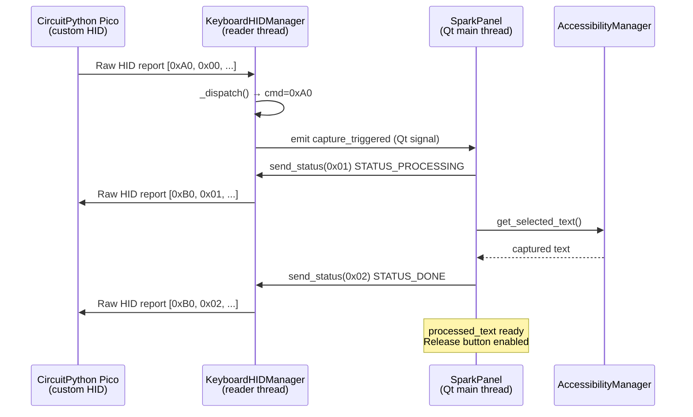
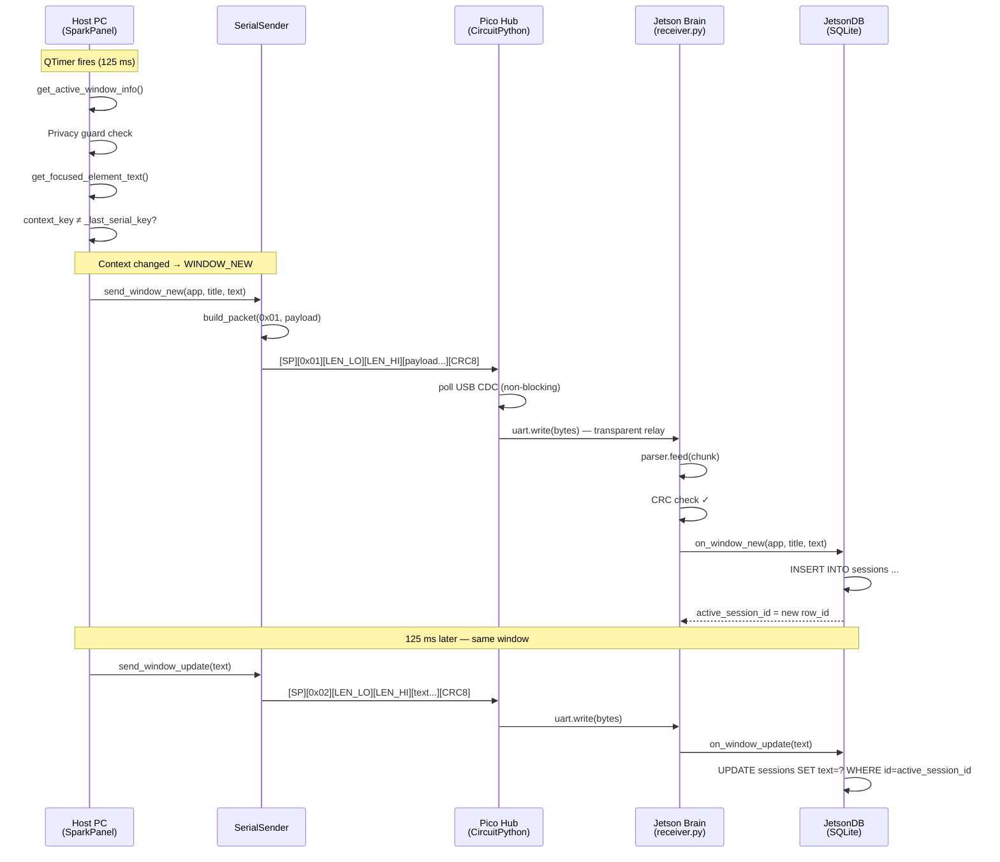
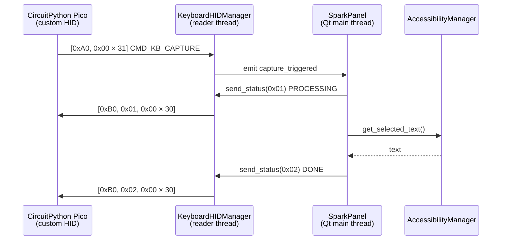

# SPARK — Engineering Specification
## Host-Side Context Engine & Firmware Integration Layer

**Version:** 1.1
**Status:** Active
**Nodes:** Host PC (macOS/Win) · Pico Hub (RP2040/CircuitPython) · Jetson Brain (NVIDIA)

---

## Table of Contents

1. [System Overview](#1-system-overview)
2. [Host-Side Engineering — Data Acquisition](#2-host-side-engineering--data-acquisition)
3. [Keyboard HID Layer](#3-keyboard-hid-layer)
4. [Firmware Integration — Pico Hub & Jetson Interface](#4-firmware-integration--pico-hub--jetson-interface)
5. [Integration Protocol — Wire Format & Handshake](#5-integration-protocol--wire-format--handshake)
6. [Error Handling & Fault Tolerance](#6-error-handling--fault-tolerance)
7. [Build & Flash Reference](#7-build--flash-reference)
8. [OpCode Reference Table](#8-opcode-reference-table)

---

## 1. System Overview

SPARK is a distributed assistive input system composed of three physically distinct compute nodes. The Host PC connects to a **single Pico Hub** over USB — the Pico runs CircuitPython firmware and exposes a USB CDC data channel for context relay, a custom Raw HID interface for command/upload traffic, and a standard keyboard HID interface for text type-back.

```
                          ┌─────────────────────────────────────────────────────┐
                          │                    HOST PC                          │
                          │              macOS / Windows                        │
                          │                                                     │
                          │  AccessibilityMgr   WindowContextTracker            │
                          │  SerialSender       SparkPanel (PyQt6)              │
                          │  KeyboardHIDManager                                 │
                          └────────┬────────────────────┬───────────────────────┘
                                   │                    │
                          USB CDC data            USB custom HID
                          (context relay)      (commands + uploads)
                                   │                    │
                          ┌────────▼────────────────────▼──────────┐
                          │              PICO HUB                   │
                          │      CircuitPython firmware             │
                          │           VID 0xC4C4  PID 0x5350        │
                          │                                         │
                          │  Custom HID iface   (host protocol)     │
                          │  CDC serial relay   (context packets)   │
                          │  Keyboard HID out   (type-back output)  │
                          │  Button GPIO scan   (GP14–GP17)         │
                          └─────────────────────┬───────────────────┘
                                                 │
                                            UART (GP0/GP1)
                                                 │
                                    ┌────────────▼────────┐
                                    │    JETSON BRAIN      │
                                    │    NVIDIA Jetson     │
                                    │                      │
                                    │    PacketParser      │
                                    │    JetsonDB          │
                                    │    LLM interface     │
                                    └──────────────────────┘
```

---

## 2. Host-Side Engineering — Data Acquisition

### 2.1 Polling Architecture

The Host runs a deterministic 8 Hz acquisition loop driven by a `QTimer` with a 125 ms period. Each tick must complete within **40 ms** to maintain headroom before the next tick arrives.

```
125 ms tick budget
├─ OS Accessibility API call    ≤ 20 ms   (AXUIElement / UIA)
├─ Privacy guard evaluation     ≤  1 ms   (in-memory set/list lookup)
├─ Browser tab AppleScript      ≤ 10 ms   (only when active app is a browser)
├─ Context key comparison       ≤  1 ms
├─ Serial packet build + write  ≤  3 ms
└─ Qt UI update                 ≤  5 ms
                              ────────
                         Total ≤ 40 ms   (leaves 85 ms idle headroom)
```

If any single call exceeds 40 ms (e.g., AppleScript stall), the next tick is simply delayed — the `QTimer` is non-accumulating. No packets are dropped; the loop self-corrects on the next cycle.

### 2.2 AccessibilityManager

`AccessibilityManager` is a platform-agnostic façade over two OS-specific providers:

| Platform | Provider | API |
|---|---|---|
| macOS | `MacOSAccessibilityProvider` | `AXUIElement`, `NSWorkspace` via PyObjC |
| Windows | `WindowsAccessibilityProvider` | UI Automation (stub, future) |

The manager attempts text extraction in priority order:

```
1. get_focused_element_text()   → AXValue of focused AX element
2. get_window_text()            → AXValue of front window
```

The first non-empty result is used. `TextSource` enum (`FOCUSED_ELEMENT`, `FULL_WINDOW`) is recorded alongside the text for provenance tracking.

### 2.3 State Tracking — New Window vs. Existing Window

`WindowContextTracker` maintains a `context_key` for the active window. The key is computed as:

```
context_key = f"{app_name}|{url}"    # browser tab (Safari, Chrome)
context_key = f"{app_name}|{title}"  # all other applications
```

On each poll tick `_on_poll_tick()` compares the current `context_key` against `self._last_serial_key`:

```
┌─────────────────────────────────────────┐
│            Poll Tick (125 ms)           │
└────────────────────┬────────────────────┘
                     │
           ┌─────────▼──────────┐
           │  Get active window │
           │  (AccessibilityMgr)│
           └─────────┬──────────┘
                     │
           ┌─────────▼──────────┐
           │  Privacy Guard     │◄── blocked? → return (no packet sent)
           └─────────┬──────────┘
                     │
           ┌─────────▼──────────┐
           │  Extract text      │◄── no text? → return
           └─────────┬──────────┘
                     │
         ┌───────────▼───────────┐
         │  context_key changed? │
         └───┬───────────────────┘
             │                   │
            YES                  NO
             │                   │
    ┌────────▼──────┐   ┌────────▼──────┐
    │  send 0x01    │   │  send 0x02    │
    │  WINDOW_NEW   │   │  WINDOW_UPDATE│
    └───────────────┘   └───────────────┘
```

This ensures the Jetson database receives exactly **one INSERT per window visit** and **N UPDATE rows** during the visit — minimising storage and query complexity.

### 2.4 Binary Serialisation

`SerialSender` calls builders from `core/protocol.py`. All multi-byte integers are **little-endian**, matching the `struct` format character `<`.

#### WINDOW_NEW (0x01) payload layout

```
Offset  Size  struct fmt  C type     Field
──────  ────  ──────────  ─────────  ─────────────────────────
0       1     <B          uint8_t    app_name byte length (0–255)
1       N     Ns          char[]     app_name UTF-8 (no null)
1+N     1     <B          uint8_t    title byte length (0–255)
2+N     M     Ms          char[]     title UTF-8 (no null)
2+N+M   2     <H          uint16_t   text byte length (LE)
4+N+M   L     Ls          char[]     text UTF-8 (no null)
```

#### WINDOW_UPDATE (0x02) payload layout

```
Offset  Size  struct fmt  C type     Field
──────  ────  ──────────  ─────────  ─────────────────────────
0       2     <H          uint16_t   text byte length (LE)
2       L     Ls          char[]     text UTF-8 (no null)
```

#### BUTTON_PRESS (0x05) payload layout

```
Offset  Size  struct fmt  C type     Field
──────  ────  ──────────  ─────────  ─────────────────────────
0       1     <B          uint8_t    button_id (0–3)
```

---

## 3. Keyboard HID Layer

### 3.1 Overview

`KeyboardHIDManager` (`host_pc/hid/keyboard_hid.py`) manages the bidirectional custom Raw HID channel between the Host and the Pico Hub. It mirrors the structure of `GlobalHotkeyManager` — a signals class plus a manager with `start()` / `stop()` — so it integrates identically into `spark_app.py` and `spark_app_v2.py`.

```
KeyboardHIDSignals(QObject)
  .capture_triggered   pyqtSignal()       ← keyboard key pressed: trigger capture
  .release_triggered   pyqtSignal()       ← keyboard key pressed: trigger release
  .connected_changed   pyqtSignal(bool)   ← device plugged / unplugged

KeyboardHIDManager
  .start()             open device + start daemon reader thread
  .stop()              join thread + close device
  .send_status(byte)   write CMD_HOST_STATUS report to keyboard
```

### 3.2 Device Identity

All values below are part of the current Pico USB contract and are mirrored in the host HID clients:

| Constant | Value | Source |
|---|---|---|
| `SPARK_VID` | `0xC4C4` | firmware USB identity |
| `SPARK_PID` | `0x5350` | firmware USB identity |
| `RAW_USAGE_PAGE` | `0xFF60` | SPARK custom Raw HID contract |
| `RAW_USAGE_ID` | `0x61` | SPARK custom Raw HID contract |
| `REPORT_SIZE` | `32` | host/device protocol contract |

### 3.3 Keyboard → Host Commands (0xA0–0xAF range)

The keyboard sends 32-byte reports with the command byte at position 0, matching the convention established in `spark_raw_hid_demo.py`.

| Byte 0 | Name | Description |
|---|---|---|
| `0xA0` | `CMD_KB_CAPTURE` | Physical key pressed — trigger text capture |
| `0xA1` | `CMD_KB_RELEASE` | Physical key pressed — trigger text release |

### 3.4 Host → Keyboard Feedback (0xB0–0xBF range)

`send_status(status_byte)` writes a 32-byte report with `CMD_HOST_STATUS` at byte 0 and the status code at byte 1. The Pico firmware uses this to drive host-visible status feedback.

```
Byte 0: 0xB0  CMD_HOST_STATUS
Byte 1: status code
          0x01  STATUS_PROCESSING   — capture/release started
          0x02  STATUS_DONE         — operation completed successfully
          0x03  STATUS_ERROR        — operation failed
Bytes 2–31: 0x00 (reserved)
```

### 3.5 Connection Lifecycle

```
start()
  │
  └─ daemon thread: _run()
       │
       ├─ _try_open()  ──── fail ──→ sleep 2 s → retry
       │    └── success
       │         emit connected_changed(True)
       │
       ├─ _read_loop()
       │    ├─ device.read(32, timeout=500 ms)
       │    ├─ timeout → loop (checks _running flag)
       │    └─ data → _dispatch(report)
       │         ├─ 0xA0 → emit capture_triggered
       │         ├─ 0xA1 → emit release_triggered
       │         └─ other → log + ignore
       │
       └─ on error/disconnect
            emit connected_changed(False)
            close device → retry loop
```

The 500 ms read timeout ensures `stop()` is acknowledged within ~500 ms without busy-waiting.

### 3.6 Capture / Release Sequence Diagram



### 3.7 Python Dependency

The Raw HID interface requires the `hidapi` PyPI package (installs as the `hid` module with a bundled native library). **Do not install the separate `hid` package** — it is a different library that requires a system `libhidapi` and will shadow the correct module.

```
# requirements.txt — correct
hidapi>=0.14.0   ✓

# do not add
hid>=1.0.4       ✗  (conflicts with hidapi on macOS)
```

---

## 4. Firmware Integration — Pico Hub & Jetson Interface

### 4.1 Hardware Routing

The Pico Hub (single RP2040 running CircuitPython) performs **transparent serial bridging** between two physical channels:

```
Host PC                      Pico RP2040                   Jetson Brain
────────                     ──────────                    ────────────
USB CDC data            →  usb_cdc.data              →  UART0 RX (GP1)
                             UART0 TX (GP0)
```

| Signal | Pico Pin | Direction | Notes |
|---|---|---|---|
| USB D+/D- | USB connector | ↔ Host | CDC serial, 115200 baud |
| UART TX | GP0 | → Jetson | 115200 baud, 8N1 |
| UART RX | GP1 | ← Jetson | (reserved, future ACK) |
| Button 0 | GP14 | ← GND via switch | Active-low, pull-up enabled |
| Button 1 | GP15 | ← GND via switch | Active-low, pull-up enabled |
| Button 2 | GP16 | ← GND via switch | Active-low, pull-up enabled |
| Button 3 | GP17 | ← GND via switch | Active-low, pull-up enabled |

The relay loop runs at ~100 Hz (10 ms sleep), well above the 8 Hz incoming packet rate. USB bytes are forwarded in 64-byte chunks via `select.poll()` with a zero timeout (non-blocking).

### 4.2 Packet Interleaving — Button Injection

The Pico Hub never decodes Host packets. It treats the Host byte stream as opaque and writes it verbatim to UART. Button packets are **injected between Host packets** at naturally occurring boundaries.

```
Loop iteration (10 ms)
│
├─ 1. poll USB CDC (non-blocking)
│     if data available → uart.write(chunk)          ← Host bytes forwarded first
│
└─ 2. scan GPIO 14–17 for falling edge
      if button pressed → uart.write(BUTTON_PRESS)   ← injected after, never during
```

Because all SPARK packets are self-framed (MAGIC + CRC), even if an injection occurs between two back-to-back Host packets, the Jetson `PacketParser` will correctly parse all three packets in sequence.

### 4.3 Jetson SQL State Machine

`JetsonDB` maintains a single `active_session_id` integer. The state machine has three transitions:

```
                    ┌─────────────────────────────────────────┐
                    │          Jetson PacketParser             │
                    └───────────────┬─────────────────────────┘
                                    │ on_packet(dict)
                    ┌───────────────▼────────────────────────┐
                    │         handle_packet()                 │
                    └──┬──────────────┬──────────────┬───────┘
                       │              │               │
               type=0x01        type=0x02        type=0x05
                       │              │               │
           ┌───────────▼──┐  ┌────────▼──────┐  ┌────▼────────────────────┐
           │   INSERT      │  │    UPDATE     │  │  Query active session   │
           │   sessions    │  │   sessions    │  │  → pass to LLM context  │
           │               │  │   SET text=?  │  │                         │
           │  store new    │  │   WHERE id=   │  │  (future: trigger LLM   │
           │  row_id as    │  │   active_id   │  │   inference call)       │
           │  active_id    │  │               │  │                         │
           └───────────────┘  └───────────────┘  └─────────────────────────┘
```

#### SQL Schema

```sql
CREATE TABLE sessions (
    id          INTEGER PRIMARY KEY AUTOINCREMENT,
    app_name    TEXT    NOT NULL,
    title       TEXT    NOT NULL,
    text        TEXT    NOT NULL DEFAULT '',
    started_at  REAL    NOT NULL,  -- Unix timestamp
    updated_at  REAL    NOT NULL   -- Unix timestamp, updated on every 0x02
);

CREATE TABLE button_events (
    id          INTEGER PRIMARY KEY AUTOINCREMENT,
    button_id   INTEGER NOT NULL,          -- 0–3
    session_id  INTEGER,                   -- FK → sessions.id (nullable)
    timestamp   REAL    NOT NULL
);
```

---

## 5. Integration Protocol — Wire Format & Handshake

### 5.1 Packet Frame

Every packet on the wire uses this identical frame:

```
 Byte 0    Byte 1    Byte 2    Byte 3    Byte 4    Byte 5..N    Byte N+1
┌─────────┬─────────┬─────────┬─────────┬─────────┬───────────┬─────────┐
│  0x53   │  0x50   │  TYPE   │ LEN_LO  │ LEN_HI  │  PAYLOAD  │  CRC8   │
│  'S'    │  'P'    │ 1 byte  │         │  (LE)   │ LEN bytes │ 1 byte  │
└─────────┴─────────┴─────────┴─────────┴─────────┴───────────┴─────────┘
│◄─────── MAGIC ──────────────►│◄────── HEADER ───────────────►│         │
│◄─────────────────────── CRC covers everything above ─────────►│         │
```

| Field | Size | Type | Description |
|---|---|---|---|
| MAGIC | 2 bytes | `uint8_t[2]` | `{0x53, 0x50}` — sync sequence `'SP'` |
| TYPE | 1 byte | `uint8_t` | OpCode — see §8 |
| LEN | 2 bytes | `uint16_t` LE | Payload byte count |
| PAYLOAD | LEN bytes | `uint8_t[]` | OpCode-specific data |
| CRC8 | 1 byte | `uint8_t` | CRC-8/MAXIM over all preceding bytes |

Minimum packet size: **6 bytes** (0-byte payload). Maximum payload: **65535 bytes**.

### 5.2 CRC Algorithm

**CRC-8/MAXIM** (Dallas 1-Wire): poly = `0x31`, reflected input and output, init = `0x00`, XorOut = `0x00`.

```c
uint8_t crc8(const uint8_t *data, size_t len) {
    uint8_t crc = 0;
    for (size_t i = 0; i < len; i++) {
        crc ^= data[i];
        for (int b = 0; b < 8; b++)
            crc = (crc & 1) ? (crc >> 1) ^ 0x8C : (crc >> 1);
    }
    return crc;
}
```

### 5.3 Sequence Diagram — Window Change Event



### 5.4 Sequence Diagram — Keyboard-Initiated Capture



---

## 6. Error Handling & Fault Tolerance

### 6.1 Host USB Disconnect (Pico Hub unplugged — CDC interface)

`SerialSender._send()` catches `serial.SerialException` on write and sets `self._serial = None`. The host continues operating normally. No reconnect timer in v1.1; reconnect on app restart.

### 6.2 Host USB Disconnect (Pico Hub unplugged — HID interface)

`KeyboardHIDManager._read_loop()` catches all exceptions and breaks out of the read loop. The outer `_run()` loop emits `connected_changed(False)`, closes the device, waits 2 seconds, and retries `_try_open()`. **Reconnect is fully automatic** — no user action required.

### 6.3 Pico Hub → Jetson UART Disconnect

The CircuitPython Pico relay has no end-to-end write acknowledgement on the Jetson UART path — `uart.write()` is effectively fire-and-forget. Bytes written while the Jetson is not listening are silently dropped. When the Jetson receiver restarts it re-synchronises on the next `MAGIC` sequence.

### 6.4 CRC Failure on Jetson

`PacketParser._dispatch()` discards any packet whose computed CRC does not match and calls `_reset()`. The parser re-enters `_SYNC` state. A single corrupted packet does not affect subsequent packets.

### 6.5 Jetson UART Buffer Full

The Jetson `serial.read(256)` call has a 1-second timeout. If the read loop stalls, the OS UART FIFO will overflow and drop bytes. The `PacketParser` will detect the framing error via CRC mismatch and re-synchronise. For v2.0, the receiver should run in a dedicated thread with a queue.

### 6.6 No Active Session on UPDATE

If `JetsonDB.on_window_update()` is called before any `on_window_new()`, `active_session_id` is `None`. The method logs a warning and returns without executing the `UPDATE`.

---

## 7. Build & Flash Reference

### 7.1 Pico Hub Firmware (single RP2040 — CircuitPython)

The single Pico Hub runs CircuitPython firmware. In the current design:

- `boot.py` sets USB identity to VID `0xC4C4` / PID `0x5350`
- `boot.py` enables USB CDC data and exposes the HID interfaces required by the Host
- `code.py` runs the CDC-to-UART relay loop, button scanning, custom Raw HID protocol handling, and keyboard type-back behavior

[`pico/main.py`](pico/main.py) remains the readable reference for the Pico-side relay and button-injection behavior, even though the deployed firmware is a CircuitPython `boot.py` / `code.py` pair.

**Flash CircuitPython** (Pico must be in bootloader mode — hold BOOTSEL while plugging in):

1. Download the Raspberry Pi Pico UF2 from `https://circuitpython.org/board/raspberry_pi_pico/`
2. Copy the UF2 to the `RPI-RP2` boot drive
3. Wait for the board to reboot as `CIRCUITPY`

**Deploy firmware files**:

1. Copy the CircuitPython `boot.py` and `code.py` files to `CIRCUITPY`
2. Reboot the Pico if needed so the USB configuration in `boot.py` is applied

**Verify**:

- The device should enumerate as VID `0xC4C4` PID `0x5350`
- The Host should see the expected custom Raw HID interface and a CDC serial device
- The Pico should continue relaying context packets over UART at `115200`

### 7.2 Host App Dependencies

```bash
cd SPARK
source .venv/bin/activate
pip install -r requirements.txt
```

Key dependency note: `hidapi>=0.14.0` provides the `hid` Python module with a bundled native library. Do **not** install the separate `hid` package alongside it — the two conflict on macOS.

### 7.3 Running the App

```bash
source .venv/bin/activate
python spark_app_v2.py
```

---

## 8. OpCode Reference Table

### Serial Protocol (Host ↔ Hub ↔ Jetson)

| OpCode | Name | Direction | Payload | DB Action on Jetson |
|---|---|---|---|---|
| `0x01` | `WINDOW_NEW` | Host → Hub → Jetson | `uint8 app_len` + `app_name` + `uint8 title_len` + `title` + `uint16 text_len` + `text` | `INSERT INTO sessions` → store `active_session_id` |
| `0x02` | `WINDOW_UPDATE` | Host → Hub → Jetson | `uint16 text_len` + `text` | `UPDATE sessions SET text WHERE id = active_session_id` |
| `0x03` | `WINDOW_CLOSE` | *(reserved)* | *(TBD)* | Finalise active session |
| `0x04` | `HOST_PING` | *(reserved)* | none | Heartbeat / keep-alive; no DB write |
| `0x05` | `BUTTON_PRESS` | Hub → Jetson | `uint8 button_id` | `INSERT INTO button_events` → fetch session context for LLM |
| `0x06` | `LLM_RESULT` | *(reserved)* | `uint16 text_len` + `text` | Jetson LLM result → route to HID output |

### Raw HID Protocol (Host ↔ Pico custom HID, 32-byte reports)

| Byte[0] | Name | Direction | Byte[1] | Description |
|---|---|---|---|---|
| `0xA0` | `CMD_KB_CAPTURE` | Keyboard → Host | — | Physical key triggered capture |
| `0xA1` | `CMD_KB_RELEASE` | Keyboard → Host | — | Physical key triggered release |
| `0xB0` | `CMD_HOST_STATUS` | Host → Keyboard | status code | `0x01` processing · `0x02` done · `0x03` error |

> **String encoding:** all `text`, `app_name`, and `title` fields are UTF-8, no null terminator. Length fields are byte counts (not character counts).
> **Endianness:** all multi-byte integers are **little-endian** (`<` in Python `struct`, `__attribute__((packed))` in C with `uint16_t`).
> **Unknown OpCodes:** firmware and host implementations must not error on unknown OpCodes — log and discard.
