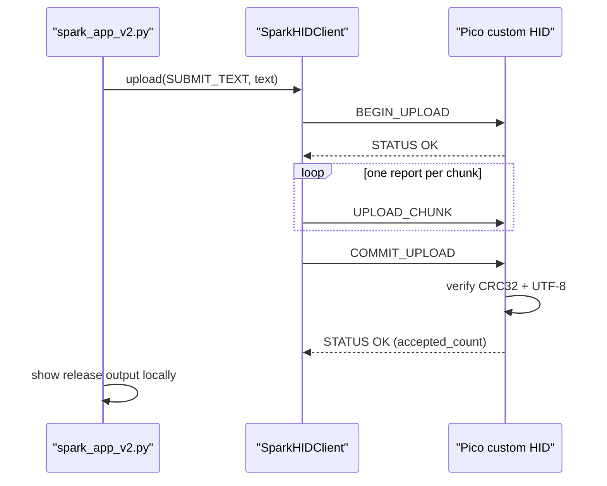
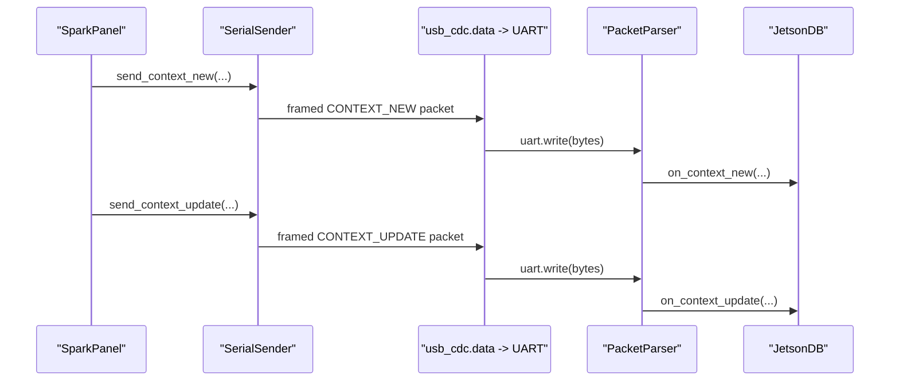
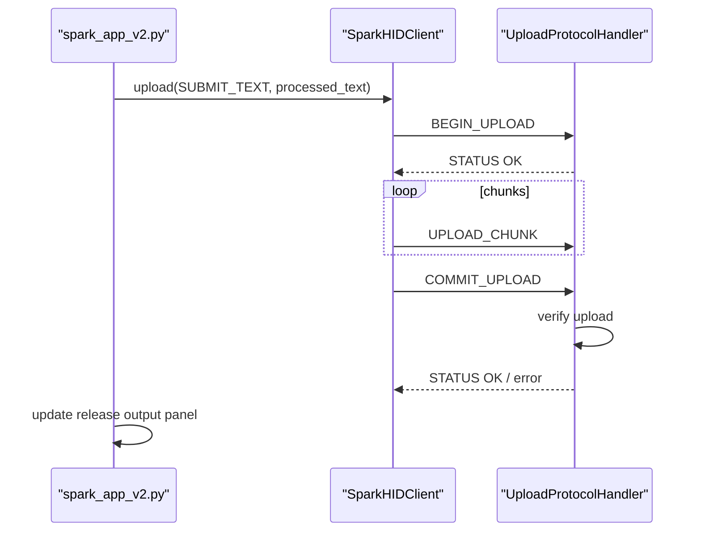

# SPARK Engineering Specification
## Host Context Engine and CircuitPython Pico Hub

**Version:** 1.2  
**Status:** Active  
**Nodes:** Host PC (macOS/Windows) -> Pico Hub (RP2040/CircuitPython) -> Jetson Brain (NVIDIA)

---

## Table of Contents

1. [System Overview](#1-system-overview)
2. [Host-Side Engineering](#2-host-side-engineering)
3. [Host HID Upload Layer](#3-host-hid-upload-layer)
4. [Pico Hub Firmware](#4-pico-hub-firmware)
5. [Wire Protocols](#5-wire-protocols)
6. [Error Handling and Fault Tolerance](#6-error-handling-and-fault-tolerance)
7. [Build and Flash Reference](#7-build-and-flash-reference)
8. [Reference Tables](#8-reference-tables)

---

## 1. System Overview

SPARK is a distributed assistive input system composed of three physically distinct compute nodes:

- Host PC: captures active-window context, keeps recent context in memory, uploads text to the Pico, and renders the desktop UI.
- Pico Hub: a single RP2040 running CircuitPython, exposing USB CDC data and custom Raw HID on one device.
- Jetson Brain: owns the UART, persists context state, and handles downstream summarize requests through a llama.cpp server.

The active host-facing contract is:

- `spark_app_v2.py` is the current desktop app path.
- `host_pc/raw_hid.py` is the active custom HID client.
- `host_pc/serial_sender.py` is the active CDC sender.
- `pico/boot.py` and `pico/code.py` are the active Pico firmware files.

Legacy `spark_app.py` and `host_pc/hid/keyboard_hid.py` remain in the repo for reference, but they are not part of the current CircuitPython firmware contract.

### 1.1 Data Paths

- Host -> Pico over USB CDC data:
  - framed context packets (`CONTEXT_NEW`, `CONTEXT_UPDATE`)
  - optional framed summarize packets for direct path debugging
- Host -> Pico over custom Raw HID:
  - capability query
  - upload begin/chunk/commit/abort
  - ping
  - response-info / response-chunk reads
- Pico -> Jetson over UART0:
  - relayed framed host context packets
  - framed `SUMMARIZE_REQUEST` packets
  - framed `SUMMARIZE_CHUNK` / `SUMMARIZE_DONE` / `ERROR` packets

---

## 2. Host-Side Engineering

### 2.1 Polling Architecture

The host runs a deterministic 8 Hz acquisition loop driven by a `QTimer` with a 125 ms period. Each tick should complete within 40 ms to preserve headroom.

Nominal tick budget:

- OS accessibility query: <= 20 ms
- privacy guard evaluation: <= 1 ms
- browser tab enrichment: <= 10 ms
- context-key comparison: <= 1 ms
- serial packet build + write: <= 3 ms
- Qt UI update: <= 5 ms

### 2.2 Accessibility Extraction

`AccessibilityManager` is a platform facade over:

- `MacOSAccessibilityProvider`
- `WindowsAccessibilityProvider`

For normal desktop apps, text extraction priority is still:

1. focused element text
2. front window text

For supported browsers, `spark_app_v2.py` now runs a browser-first pipeline before
accepting raw accessibility fallbacks:

1. resolve browser tab metadata through `host_pc/browser.py`
2. on macOS, attempt live-tab extraction through `host_pc/web_content.py`
3. on Windows, attempt live UIA document extraction through `host_pc/web_content_windows.py`
4. on Windows, if the URL is fetchable and live extraction is weak, try HTTP article extraction through `host_pc/web_content.py`
5. only then evaluate focused-element or front-window accessibility text, and on Windows accept those fallbacks only if the browser-noise heuristics say they look like real page content

The selected text is tracked with `TextSource`, and browser-chrome-only captures are intentionally rejected before they reach Jetson.

### 2.3 Window Tracking

`WindowContextTracker` derives a `context_key`:

- browser tabs: `"{app_name}|{url}"`
- other apps: `"{app_name}|{title}"`

On each poll tick:

- if the active window is the SPARK panel, the debug watcher, or the Jetson DB viewer, ignore it
- if the key changed, send `CONTEXT_NEW`
- if the key is unchanged, send `CONTEXT_UPDATE`

This yields exactly one Jetson session insert per contiguous window visit and repeated updates while the window remains active.

### 2.4 Host Debug Surfaces

The active host app exposes a read-only Jetson DB viewer for local debugging:

- `View Jetson DB` creates a validated temporary snapshot copy of `jetson_spark.db`
- snapshot reads use SQLite URI read-only mode
- the dialog pages rows in bounded chunks (`limit=100` by default) and can append additional pages through `Load More`
- refresh failures should preserve the last good snapshot and visible rows until a new snapshot is ready

### 2.5 Serial Payload Layouts

All structured serial packets use the shared framed contract in `core/protocol.py`:

- frame:
  - magic bytes `SP`
  - packet type
  - little-endian payload length
  - payload bytes
  - CRC-8/MAXIM
- JSON payload packets:
  - version byte
  - UTF-8 JSON object

Current framed packet families:

- `CONTEXT_NEW (0x01)`
- `CONTEXT_UPDATE (0x02)`
- `SUMMARIZE_REQUEST (0x03)`
- `SUMMARIZE_CHUNK (0x04)`
- `SUMMARIZE_DONE (0x06)`
- `ERROR (0x07)`
- `DEBUG (0x08)`

---

## 3. Host HID Upload Layer

### 3.1 Overview

The active host-to-device HID contract is `SparkHIDClient` in `host_pc/raw_hid.py`.

The current `spark_app_v2.py` flow is:

- capture or prepare text on the host
- upload text to the Pico through custom Raw HID
- receive a final `STATUS` reply
- render the released text locally in the SPARK app after the Pico acknowledges it

The current `Summarize Window` flow is:

- build a structured summarize request from the active window on the host
- upload that request to the Pico through custom Raw HID with `FEATURE_1`
- forward the accepted request to Jetson over framed UART packets
- stream the Jetson response back into the Pico response buffer
- poll that response buffer from the host and render partial updates in `RELEASE OUTPUT`

The older `KeyboardHIDManager` trigger/status flow is legacy only and is not implemented by the current CircuitPython firmware.

### 3.2 Device Identity

These values are part of the active USB contract:

| Constant | Value | Notes |
|---|---|---|
| `SPARK_VID` | `0xC4C4` | USB vendor ID |
| `SPARK_PID` | `0x5350` | USB product ID |
| `RAW_USAGE_PAGE` | `0xFF60` | custom Raw HID usage page |
| `RAW_USAGE_ID` | `0x61` | custom Raw HID usage |
| `REPORT_SIZE` | `32` | fixed HID report size |
| `CHUNK_PAYLOAD_SIZE` | `27` | upload payload bytes per chunk |

### 3.3 Custom HID Commands

The host sends and receives fixed 32-byte reports. Byte 0 is the command byte.

| Byte[0] | Name | Direction | Description |
|---|---|---|---|
| `0x01` | `GET_INFO` | Host <-> Pico | query protocol/version/limits |
| `0x20` | `GET_RESPONSE_INFO` | Host <-> Pico | query buffered response length/chunk count/flags |
| `0x21` | `GET_RESPONSE_CHUNK` | Host <-> Pico | read one buffered response chunk |
| `0x10` | `BEGIN_UPLOAD` | Host -> Pico | start upload session |
| `0x11` | `UPLOAD_CHUNK` | Host -> Pico | write one chunk |
| `0x12` | `COMMIT_UPLOAD` | Host -> Pico | finalize and acknowledge upload |
| `0x13` | `ABORT_UPLOAD` | Host -> Pico | cancel active upload |
| `0x7F` | `STATUS` | Pico -> Host | result/status reply |

Application commands carried inside uploads:

| App Command | Value | Meaning |
|---|---|---|
| `SUBMIT_TEXT` | `0x0001` | acknowledge uploaded text for host-side release output |
| `PING` | `0x0002` | return readiness detail string |
| `FEATURE_1` | `0x0101` | host-to-Pico round-trip text used by `Summarize Window` |

### 3.4 Upload Semantics

`BEGIN_UPLOAD` includes:

- `message_id`
- `app_command`
- `encoding`
- `total_len`
- `crc32`

`UPLOAD_CHUNK` includes:

- `message_id`
- `chunk_index`
- up to 27 bytes of payload

`COMMIT_UPLOAD` succeeds only if:

- the upload session is active
- the message id matches
- all chunks were received
- CRC32 matches
- the payload decodes as UTF-8

### 3.5 Submit-Text Acknowledgement

For `SUBMIT_TEXT`, the Pico validates the upload and acknowledges it without
injecting keyboard input back into the host.

`COMMIT_UPLOAD` returns:

- `STATUS.OK`
- `value0 = accepted_count`
- `value1 = 0`
- a short detail string such as `accepted`

For `PING`, the Pico returns `STATUS.OK` with a short detail string such as `spark ready`.

### 3.6 Device Response Buffer

After a successful upload, the Pico can store a UTF-8 response buffer that the host reads back through:

- `GET_RESPONSE_INFO`
- `GET_RESPONSE_CHUNK`

The currently verified device-side behavior is:

- `SUBMIT_TEXT`: Pico stores an echo-form response string
- `FEATURE_1`: Pico forwards the request to Jetson, buffers framed streamed response bytes, and marks completion on `SUMMARIZE_DONE`
- `PING`: still returns readiness through `STATUS`

`GET_RESPONSE_INFO` also carries response-state flags:

- bit 0: response complete
- bit 1: downstream request active

The host polls this response buffer on a second 125 ms timer so summarize streaming does not block the main context poll loop.

### 3.7 Upload Sequence



### 3.7 Host Dependency Note

The custom HID path depends on the `hidapi` package, which installs as the `hid` Python module. Do not install the unrelated `hid` package alongside it.

---

## 4. Pico Hub Firmware

### 4.1 Runtime Model

The Pico is a single CircuitPython device split into:

- `boot.py`
  - sets USB identity
  - enables USB CDC data
  - enables one custom Raw HID interface
- `code.py`
  - initializes UART0 on `GP0`/`GP1` at `115200`
  - relays host CDC data to Jetson UART
  - forwards `FEATURE_1` summarize requests to Jetson UART
  - buffers streamed Jetson response bytes for host HID polling
  - handles the V2 custom HID upload protocol

Supporting modules:

- `pico/jetson_transport.py`
- `pico/upload_protocol.py`
- `pico/serial_bridge.py`
- `pico/usb_config.py`

`pico_reference/main.py` remains a behavioral reference, not the deployed runtime entrypoint.

### 4.2 Hardware Routing

| Signal | Pico Pin | Direction | Notes |
|---|---|---|---|
| USB D+/D- | USB connector | -> Host | CDC data + custom HID |
| UART TX | `GP0` | -> Jetson | `115200`, 8N1 |
| UART RX | `GP1` | <- Jetson | summarize response bytes |

### 4.3 Cooperative Loop

The deployed runtime uses a short cooperative loop. Each iteration:

1. relays any available CDC host bytes to UART in bounded reads
2. polls the Jetson UART summarize transport
3. updates the host-readable Raw HID response buffer state
4. processes the latest custom HID report
5. sleeps for roughly 2 ms

This keeps summarize transport and HID acknowledgements responsive without any keyboard type-back path in the active runtime.

### 4.4 Serial Relay Behavior

The Pico does not decode host CDC packets. It forwards the host byte stream verbatim to UART.

Because all SPARK serial packets are self-framed with magic bytes, payload length, and CRC, the Jetson parser can recover packet boundaries correctly across incremental CDC-to-UART writes.

### 4.5 Jetson State Model

`JetsonDB` maintains a single `active_session_id`.

- `CONTEXT_NEW` inserts a new rich session row and sets `active_session_id`
- `CONTEXT_UPDATE` updates the active session text and metadata

---

## 5. Wire Protocols

### 5.1 Serial Packet Frame

Every serial packet on the Host -> Pico -> Jetson path uses:

- 2-byte magic: `SP`
- 1-byte packet type
- 2-byte payload length, little-endian
- payload bytes
- 1-byte CRC-8/MAXIM over all preceding bytes

Minimum packet size is 6 bytes.

### 5.2 CRC

Serial framing uses CRC-8/MAXIM (Dallas 1-Wire style), polynomial `0x31`, reflected form.

### 5.3 Serial Sequence: Window Update



### 5.4 HID Sequence: Upload and Acknowledge



---

## 6. Error Handling and Fault Tolerance

### 6.1 Host CDC Disconnect

`SerialSender` write failures are isolated to the serial path. The host app continues running even if the Pico CDC interface is absent.

### 6.2 Host HID Disconnect

`SparkHIDClient` opens the HID device lazily. If the Pico is missing, `is_connected()` returns `False` and HID operations fail with `SparkProtocolError`. When the device is plugged back in, later calls can reopen it.

### 6.3 Pico to Jetson UART Disconnect

The Pico relay has no end-to-end UART acknowledgement. `uart.write()` is effectively fire-and-forget. If the Jetson is not listening, bytes may be dropped until the receiver resumes and re-synchronizes on the next valid packet frame.

### 6.4 CRC Failure on Jetson

`PacketParser` discards packets whose CRC does not match and returns to sync state. A single corrupted packet should not poison subsequent packets.

### 6.5 No Active Session on Update

If the Jetson receives `CONTEXT_UPDATE` before `CONTEXT_NEW`, `JetsonDB` should log and ignore the update rather than writing inconsistent state.

---

## 7. Build and Flash Reference

### 7.1 Install CircuitPython

1. Hold `BOOTSEL` while plugging the Pico into USB.
2. Copy the Raspberry Pi Pico CircuitPython UF2 onto the `RPI-RP2` drive.
3. Wait for the board to reboot as `CIRCUITPY`.

### 7.2 Deploy Firmware Files

Copy the following from the repo onto the board:

- `pico/boot.py` -> `CIRCUITPY/boot.py`
- `pico/code.py` -> `CIRCUITPY/code.py`
- `pico/protocol.py`
- `pico/jetson_transport.py`
- `pico/upload_protocol.py`
- `pico/serial_bridge.py`
- `pico/usb_config.py`

Reboot the Pico after copying `boot.py` so the USB configuration is applied.

### 7.3 Verify

Expected results:

- board enumerates as VID `0xC4C4` / PID `0x5350`
- host sees one CDC data interface
- host sees one custom Raw HID interface on usage page `0xFF60`, usage `0x61`
- `SparkHIDClient.get_info()` succeeds
- `FEATURE_1` summarize requests reach Jetson and return buffered streamed text
- longer Jetson summarize responses are chunked across multiple framed UART packets and still complete on the real board

### 7.4 Host App Dependencies

```bash
cd SPARK
source .venv/bin/activate
pip install -r requirements.txt
```

Important packages:

- `hidapi`
- `pyserial`

### 7.5 Run the Host App

```bash
source .venv/bin/activate
python spark_app_v2.py
```

---

## 8. Reference Tables

### 8.1 Serial Protocol

| OpCode | Name | Direction | Payload |
|---|---|---|---|
| `0x01` | `CONTEXT_NEW` | Host -> Pico -> Jetson | versioned JSON context payload |
| `0x02` | `CONTEXT_UPDATE` | Host -> Pico -> Jetson | versioned JSON context payload |
| `0x03` | `SUMMARIZE_REQUEST` | Host/Pico -> Jetson | versioned JSON summarize request |
| `0x04` | `SUMMARIZE_CHUNK` | Jetson -> Pico | versioned JSON summarize response chunk |
| `0x06` | `SUMMARIZE_DONE` | Jetson -> Pico | versioned JSON completion marker |
| `0x07` | `ERROR` | Jetson -> Pico | versioned JSON error payload |
| `0x08` | `DEBUG` | Pico -> Host | versioned JSON debug message (`{"msg": "..."}`) |

### 8.2 Custom Raw HID Protocol

| Byte[0] | Name | Direction | Notes |
|---|---|---|---|
| `0x01` | `GET_INFO` | Host <-> Pico | capability query |
| `0x20` | `GET_RESPONSE_INFO` | Host <-> Pico | buffered response metadata |
| `0x21` | `GET_RESPONSE_CHUNK` | Host <-> Pico | buffered response data |
| `0x10` | `BEGIN_UPLOAD` | Host -> Pico | start upload |
| `0x11` | `UPLOAD_CHUNK` | Host -> Pico | send chunk |
| `0x12` | `COMMIT_UPLOAD` | Host -> Pico | finalize upload |
| `0x13` | `ABORT_UPLOAD` | Host -> Pico | abort upload |
| `0x7F` | `STATUS` | Pico -> Host | result reply |

Legacy `0xA0` / `0xA1` / `0xB0` keyboard-trigger/status reports are not part of the current CircuitPython firmware contract.

### 8.3 Encoding and Endianness

- all strings are UTF-8
- length fields are byte counts, not character counts
- all multi-byte integers are little-endian
