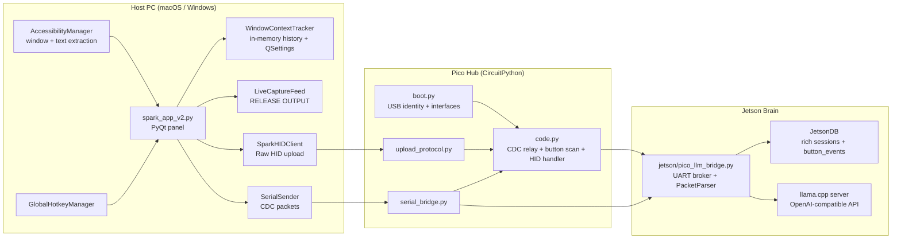

# SPARK System Diagram

This is the current high-level architecture for the active branch.

## Notes

- The host has two independent device paths:
  - Raw HID for `Release Text` uploads and device status.
  - USB CDC serial for `CONTEXT_NEW` / `CONTEXT_UPDATE` and direct framed summarize packets heading toward the Jetson.
- The Pico acknowledges text uploads but does not type text back into the focused external app in the active runtime.
- The active `spark_app_v2.py` runtime does not use a host-local SQLite database. Jetson is the durable state owner for captured context.
- `pico/main.py` remains a readable reference, but the deployed firmware entrypoints are `pico/boot.py` and `pico/code.py`.
